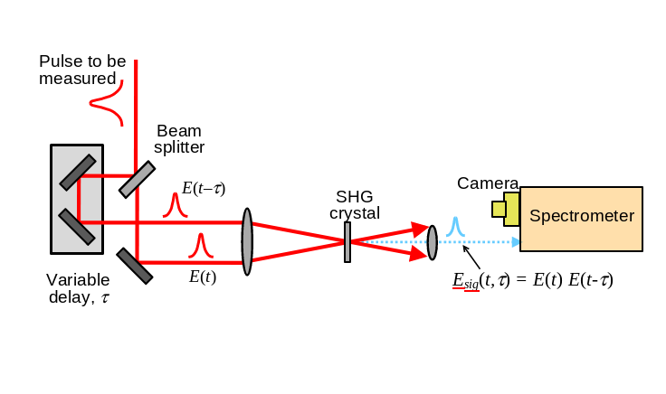
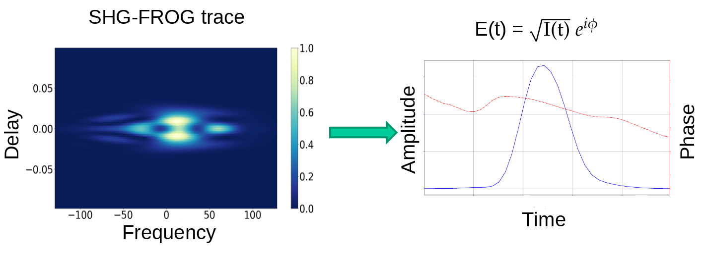

# Neural Networks for Pulse Retrieval

## Problem description

Phase retrieval problem appears when measuring ultrashort laser pulses. This pulses last less than a picosecond ($10^{-12}$ s), so no electronical measurements can be done to get the electric field of the pulse in time or frequency domain. In the last years, optical measurements have been developed to the extreme of being able to measure in the scale of attoseconds ($10^{-18}$ s).

An optical measurement that determines the electric field of the pulse to be measured is the SHG-FROG trace (Second Harmonic Generation - Frequency Resolved Optical Gating trace).

*Figure 1: Experimental setup for measuring SHG-FROG traces. Image credits: Rick Trebino.*

We will not go into detail on how this experimental measure is carried out. The important thing to understand is that what is performed is an autocorrelation of the pulse with a delayed copy of itself, passing it through a second harmonic generation crystal which creates a signal proportional to the product of the two incident pulses. There are different experimental variations of this step, but the objective of all of them is finally to extract, by passing the resulting signal of the SHG crystal through a spectrometer, the SHG-FROG trace of the incident pulse, which has the following expression:

$$\tilde{T}(\omega, \tau) = \left|\int_{-\infty}^{\infty} E(t) E(t - \tau) e^{i \omega t} \text{d} t \right|^2$$

This expression provides us with information in both the time and frequency domains. It tells us for each delay introduced to the pulse what is the spectrum obtained in the frequency domain. It is similar (but not the same) to a spectrogram in acoustics.

Note that if a temporal translation of the pulse is performed, it is conjugated or a phase shift is performed, the same SHG-FROG trace will be obtained.

A mathematical manipulation can be performed on the above expression to transform it into a two-dimensional Fourier transform:

$$\tilde{T}(\omega, \tau) = \left|\int_{-\infty}^{\infty}\int_{-\infty}^{\infty} \bar{E}_{sig}(t, \Omega) e^{-i \omega t - i \Omega \tau} \text{d} t \text{d} \Omega \right|^2$$

Where $\bar{E}_{sig}(t, \Omega)$ is the Fourier transform with respect to $\tau$ of $E_{sig} = E(t) E(t - \tau)$, which is commonly referred to as the *signal operator*.

There is no need to worry about understanding this last step, the important thing is to see that this expression is the square of the modulus of a two-dimensional Fourier transform of $E_{sig}$. That is, we know the amplitude of the coefficients of the Fourier transform but not its phase. This is what is known as a **phase retrieval problem**. For one-dimensional Fourier transforms this problem is impossible to solve, but for more than one dimension it is possible indeed.

## Summary

In summary, the theory tells us that from a SHG-FROG trace we can recover the expression of the electric field that generated it. The electric field that represents the pulse in the time domain is a complex number that can be expressed as an intensity multiplied by a phase:

$$ E(t) = \sqrt{I(t)} e^{i \phi}$$

This electric field is passed through the experimental setup so that the SHG-FROG trace is obtained.

In practice, what will be measured is the SHG-FROG trace, so this will be a two-dimensional array of NxN elements, $\tilde{T}_{mn}$ where $m, n = 0, \dots, N-1$; and the objective is to retrieve the $2N$ numbers which represent the electric field (real and imaginary parts).

   
  <em>Figure 2: Objective to solve the problem is to transform the NxN SHG-FROG trace to the 2N values that represent the electric field in time domain.</em>

This problem can be solved employing specifical phase retrieval algorithms, such as GPA, PIE or COPRA. Check out [ultrafast-pulse-retrieval](https://github.com/Loracio/ultrafast-pulse-retrieval) repo to find more about this algorithms and see their implementations.

## Problem from NN perspective

The aim of this project is to use Neural Networks to solve the phase retrieval problem. The task for the Neural Network is to *inverse map* the $N\times N$ real values that represent the SHG-FROG trace to the $2N$ real numbers that represent the real and imaginary parts of the electric field values.

   
  <em>Figure 3: Scheme of the input and output layers of a Neural Network that solves the retrieval problem.</em>

Explanations of how to approach the problem in more detail, explaining the philosophy followed in solving the problem in the scripts, can be found in the [reports](./reports/) folder.

## Author

This code has been developed by Víctor Loras Herrero in the framework of the master's thesis inside the master's degree in mathematical modeling and research, statistics and computation of the University of Zaragoza.

For any questions or comments, you can contact me via email: <vloras@unizar.es>
