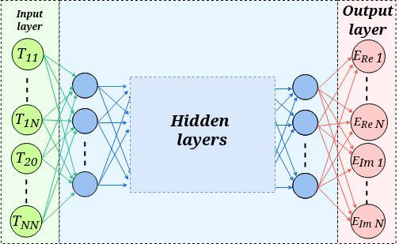

# First steps for approaching the problem

## Pulse database

The task that we want the Neural Network to permorm is to *inverse map* the $N\times N$ real values that represent the SHG-FROG trace to the $2N$ real numbers that represent the real and imaginary parts of the electric field values.

   
  <em>Figure 1: Scheme of the input and output layers of a Neural Network that solves the retrieval problem.</em>

Therefore, we will need to generate a database of simulated pulses containing both their SHG-FROG trace and the real and imaginary parts of the pulse electric field. An algorithm to perform such a task can be found at [this link](https://github.com/Loracio/ultrafast-pulse-retrieval/blob/main/src/pulse.hpp#L446) to the [`ultrafast-pulse-retrieval`](https://github.com/Loracio/ultrafast-pulse-retrieval) project, and can be used to create a database as required in this problem, as shown in the file [`testDataBaseGeneration.cpp`](https://github.com/Loracio/ultrafast-pulse-retrieval/blob/main/tests/testDataBaseGeneration.cpp).

The generated databases are .csv files containing the following structure:

|TBP | $E_{Re \ 0}$ | $\dots$ | $E_{Re \ N-1}$ | $E_{Im \ 0}$ | $\dots$ | $E_{Im \ N-1}$ | $T_{00}$ | $\dots$ | $T_{N-1 \ N-1}$

where:

- TBP: Time between pulses
- $E_{Re}$: Pulse real part (N columns)
- $E_{Im}$: Pulse imaginary part (N columns)
- $T_{mn}$: SHG-FROG trace of the pulse (NxN columns)

**Tensorflow** will be the library used in this project for the creation and training of Neural Networks, so the database has to be read and processed to be compatible with tensorflow data types.

A good practice is to normalize the input and the output of the Neural Network training and validation data. In this case, each trace is normalized by dividing by its maximum value, and the real and imaginary parts of each pulse are divided by the maximum amplitude (polar representation of complex numbers).

Database input/output handling functions are implemented inside the [`src/io`](/src/io/) folder, and will read and format the data into training and validation sets to train the Neural Network.

Now that we've got the data for training the Neural Network, we have to actually design and train it to solve our problem. We will use a *construction* approach, starting with the simplest possible model and gradually adding features that make it more complex and predictably better at solving the problem.

For a better handling and a faster training we will be using pulses with **N=64** for now on.

## Multi Layer Perceptron as a first approach

The simplest Neural Network architecture that can be employed is a Multi Layer Perceptron (MLP).

TBC...
